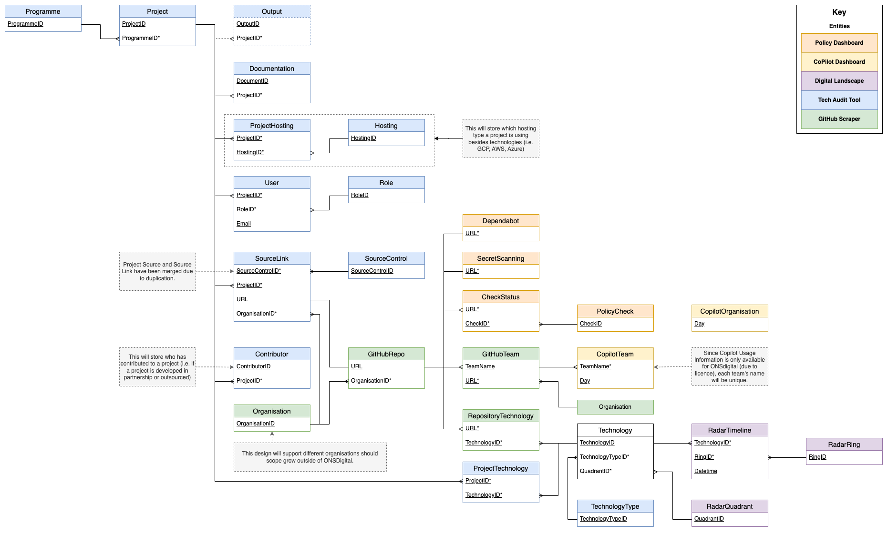

# Database Structure

## Entity Relationship Diagram (ERD)

## Tables and Schemas

The database has the following tables and schemas:

| Schema Name | Description |
|-------------|-------------|
| tat | A schema containing tables for the Tech Audit Tool |
| dl | A schema containing tables for the Digital Landscape |
| gh | A schema containing tables for the GitHub Scraper |
| gcp | A schema containing tables for the GitHub Copilot Dashboard |
| gpd | A schema containing tables for the GitHub Policy Dashboard |
| dbo | A schema containing general tables not related to any specific tool/service |

| Schema Name | Table Name | Description | Implemented? |
|-------------|------------|-------------|--------------|
| tat | programme | A table containing information about programmes | Yes |
| tat | project | A table containing information about projects | Yes |
| tat | output | A table containing information about a project's outputs | *No* |
| tat | documentation | A table containing information about project documentation | Yes |
| tat | project_hosting | A table linking projects to their hosting environments | Yes |
| tat | hosting | A table containing information about hosting environments (i.e. AWS, Azure, etc.) | Yes |
| tat | user | A table containing information about users | Yes |
| tat | role | A table containing information about user roles | Yes |
| tat | source_link | A table to relate projects and source control to specific repositories | Yes |
| tat | source_control | A table containing information about source control | Yes |
| tat | contributor | A table containing information about who has contributed to a project (i.e. A project completed in partnership with another company) | Yes |
| tat | project_technology | A table to relate projects and technologies | Yes |
| tat | technology_type | A table to categorise technologies by type (i.e. programming language, framework, etc.) | Yes |
| dl | radar_quadrant | A table define the tech radar's quadrants (Infrastructure, Languages, Frameworks, Supporting Tools) | Yes |
| dl | radar_ring | A table define the tech radar's rings (Adopt, Trial, Hold, Assess, etc.) | Yes |
| dl | radar_timeline | A table to track technology movements between rings | Yes |
| gh | organisation | A table containing information about GitHub organisations | Yes |
| gh | github_repository | A table containing information about GitHub repositories | Yes |
| gh | github_team | A table containing information about GitHub teams | Yes |
| gh | repository_technology | A table to relate GitHub repositories and technologies | Yes |
| gcp | copilot_team | A table containing information about GitHub Copilot usage at a team level | *No* |
| gcp | copilot_organisation | A table containing information about GitHub Copilot usage at an organisation level | *No* |
| gpd | check_status | A table containing information about the status of GitHub policy checks | Yes |
| gpd | policy_check | A table containing information about GitHub policy checks | Yes |
| gpd | secret_scanning | A table containing information about GitHub secret scanning alerts for repositories | Yes |
| gpd | dependabot | A table containing information about GitHub Dependabot alerts for repositories | Yes |
| dbo | technology | A table containing information about technologies | Yes |

Further documentation about the database's design can be found on Confluence: [Repository Database](https://confluence.ons.gov.uk/display/KEH/Repository+Database) (*Internal ONLY*).

## Views

The database has the following views:

| Schema Name | View Name | Description | Implemented? |
|-------------|-----------|-------------|--------------|
| dl | radar_movements | A view to track technology movements between rings and how much movement per change. | *No* |
